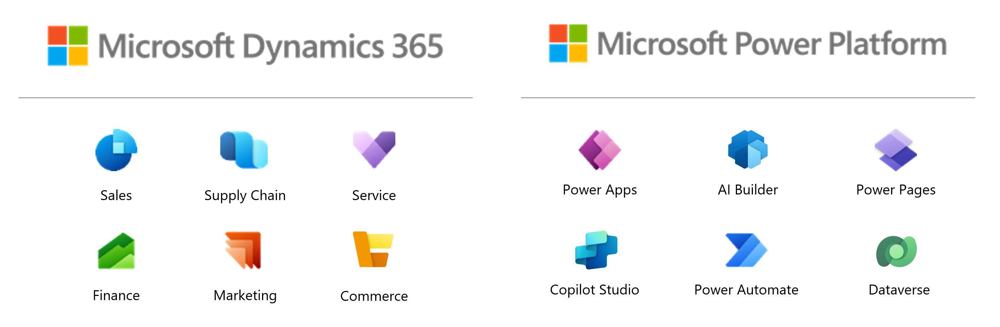

# Nonprofit: Biz Apps Demo Repository

Welcome to the Nonprofit Biz Apps Demo Repository. This repository was created to showcase sample solutions that run in the Power Platform and Dynamics 365 for our nonprofit and NGO customers.

## Solution Accelerators and Demos

### Power Platform
Below is a listing of the sample solution accelerators and demos available. These sample solution files are meant for demonstration purposes only to showcase various features across the platform.
| Demo Name | Power Apps | Power Automate | Power Pages | Copilot Studio | AI Builder | Dataverse | Premium Licensing Needed | 
| :-----: | :---: | :---: | :---: | :---: | :---: | :---: | :---: |
| [AI Pricing Tool](https://github.com/microsoft/TSI-Business-Applications/tree/main/Power-Platform/Solution-Accelerators/AI-Pricing-Tool) | ✔️ | ✔️ |  |  | ✔️ | ✔️ | ✔️ | 
| [Policy Approval Tool **(COMING SOON)**](https://github.com/microsoft/TSI-Business-Applications/tree/main/Power-Platform/Solution-Accelerators/Policy-Approval-Tool) | ✔️ | ✔️ |  |  |  | ✔️ | ✔️ | 

### Dynamics 365 ERP and Dynamics 365 CRM
Our team is working hard to bring accelerators and assets to you in our D365 ERP and D365 CRM space. Stay tuned for updates!
<!--
| Demo Name | Finance | Supply Chain | Project Operations | Commerce | Human Resources |
| --------------- | :---: | :---: | :---: | :---: | :---: | 
| [Demo Name](demos/demolink/README.md) | ✔️ | ✔️ |  |  | ✔️ |

### Dynamics 365 CRM
| Demo Name | Sales | Customers Insights | Customer Service | Contact Center | Field Service |
| --------------- | :---: | :---: | :---: | :---: | :---: | 
| [Demo Name](demos/demolink/README.md) | ✔️ | ✔️ |  |  | ✔️ |
-->

## Whitepapers
Below are whitepapers that have been created specifically for use by our nonprofit and NGO customers.
- [**The Future of Nonprofit Operations: AI-Powered Mission Delivery with Microsoft Power Platform**](https://github.com/microsoft/TSI-Business-Applications/blob/main/Power-Platform/Whitepapers/The%20Future%20of%20Nonprofit%20Operations%3A%20AI-Powered%20Mission%20Delivery%20with%20Microsoft%20Power%20Platform.md)

## Webinar Series

We have various webinar series aimed to connect with our nonprofit and NGO customers to showcase and share the latest in the Power Platform
Stay tuned as we update this site for FY26!

## Training Resources

### Power Apps and Power Automate

* [Power Platform Learning Paths](https://docs.microsoft.com/en-us/learn/powerplatform/)
* [Power Platform Center of Excellence Starter Kit](https://docs.microsoft.com/en-us/power-platform/guidance/coe/starter-kit)
* [Power CAT Adoption Maturity Model](https://powerapps.microsoft.com/en-us/blog/power-cat-adoption-maturity-model-repeatable-patterns-for-successful-power-platform-adoption/)
* [AI Builder Labs](https://docs.microsoft.com/en-us/ai-builder/learn-ai-builder)

### Dynamics 365

* [Dynamics 365 Learning Paths](https://docs.microsoft.com/en-us/learn/dynamics365/)
* [Dynamics 365 Certifications](https://docs.microsoft.com/en-us/learn/certifications/browse/?technology=Microsoft%20Dynamics%20365&products=dynamics-365)

## Submit feedback

Let us know by filing an issue. 
Before submitting your issue please search the [issues](https://github.com/microsoft/TSI-Business-Applications/issues) to ensure your issue has not already been reported

If your bug or feature request has already been reported, join the conversation by commenting and adding your reaction. Please use reactions to vote and not "+1" comments.
- 👍: upvote
- 👎: downvote
  
## Contributing

This project welcomes contributions and suggestions.  Most contributions require you to agree to a
Contributor License Agreement (CLA) declaring that you have the right to, and actually do, grant us
the rights to use your contribution. For details, visit https://cla.opensource.microsoft.com.

When you submit a pull request, a CLA bot will automatically determine whether you need to provide
a CLA and decorate the PR appropriately (e.g., status check, comment). Simply follow the instructions
provided by the bot. You will only need to do this once across all repos using our CLA.

This project has adopted the [Microsoft Open Source Code of Conduct](https://opensource.microsoft.com/codeofconduct/).
For more information see the [Code of Conduct FAQ](https://opensource.microsoft.com/codeofconduct/faq/) or
contact [opencode@microsoft.com](mailto:opencode@microsoft.com) with any additional questions or comments.

## Trademarks

This project may contain trademarks or logos for projects, products, or services. Authorized use of Microsoft 
trademarks or logos is subject to and must follow 
[Microsoft's Trademark & Brand Guidelines](https://www.microsoft.com/en-us/legal/intellectualproperty/trademarks/usage/general).
Use of Microsoft trademarks or logos in modified versions of this project must not cause confusion or imply Microsoft sponsorship.
Any use of third-party trademarks or logos are subject to those third-party's policies.
